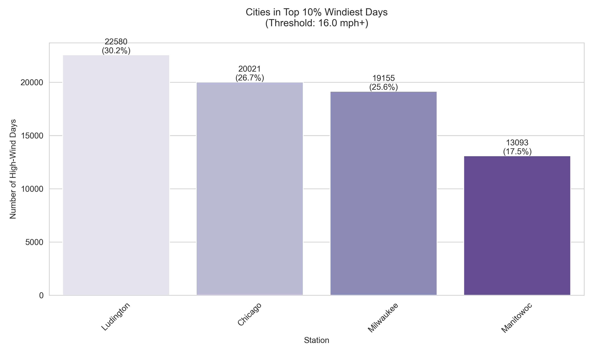

# Chicago Wind Report
#### Presented by Lauren McKay
## Introduction
  Growing up in the area, Chicago was often refered to as "The Windy City". Digging further into the etymology, this nickname stems from several sources, many of which having nothing to do with weather. One explanation for the moniker arrises from the political landscape of the city, as the belief that Chicago politicians were often corrupt, and thus full of "hot air". Furthermore, a convoluted baseball fued between the White Sox and the then Cinncinati Red Sox might also be to blame. However, the brisk wind off the shores of Lake Michigan have also been known to contribute to ths name. While being located in the pit of the lake no dobt affects the wind off the shore, could there possibly be a "Windier City" off the shores of Lake Michigan? 
  
  I aim to explore this question by comparing Chicago with three other cities off the shores of Lake Michigan, ultimately determining if Chicago righfully deserves the title. To reserach this prompt, the cities I have decided to compare are Milwaukee WI, Ludington MI, and Manitowoc WI. The data employed has been generated from the National Center for Enviornmental Information, specifically the U.S Local Climatological Data (LCD). I approach this problem by using data from each station from years 2014-2024, speicifcally looking at columns of the data related to hourly wind speeds and hourly wind gust speeds. 

  ## Daily Averages
 
To put the average wind speeds throughout time into perspective, I decided to create a graph of the four cities throughout the sample period, to see if any initial outliers existed. All of the cities follow a similar pattern as the years progress with a peak in the first few months of the year, and then another as the fall season arrives. There does not appear to be an outlier in terms of a city with substantially greater average wind speeds, although both Milwaukee and Chicago have peaks throughout the data that are readily visible. 

## Cities with the Windiest Days 
 
The graph above details the cities ranked in order of their contributions to the windiest days recorded across the cities and years. Ludington Michigan leads this metric, with over 22,000 of the windiest days. Chicago trails in with the second most days, with roughly 20,000 of the windiest days. 

## Cities with the Greatest Frequency of Wind Gusts
 
The next metric used to determine wind is the number and speed of wind gusts. A wind gust is a sudden increase in the wind speed, which is usually followed by a lull. These gusts usually last just a few seconds. Above is an illustration of the cities with the greatest frequency of wind gusts, with Ludington Michigan again leading the metric, with over half of all the wind gusts recorded. Milwaukee follows Ludington with Chicago ranking third for wind gust frequency. 

## Cities with the Intense Gusts
 
Lastly, I measured the cities with the most extreme wind gusts. In the dataset from the four cities over the 10 year period, the top percent of wind gusts measured in to roughly greater or equal to 41 miles per hour. For reference, FEMA dictates damaging winds are those exceeding 58 miles per hour. Chicago tops this metric with roughly 650 intense gusts measured throughout the period, with Milwaukee following with slightly more than 500. 

## Conclusion 
While the epithet "The Windy City" might not entierly refer to weather patterns adn the breeze created by Lake Michigan, this analysis reveals that its claim to windiness is not entirely unfounded. Among the four cities across the shores of Lake Michigan; Chicago, Milwaukee, Ludington, and Manitowoc, Chicago ranks first in extreme wind gusts. However, Ludington, Michigan, emerged as the windiest location overall leading metrics for windiest days and greatest frequency of gusts. 

Perhaps it is the strong gusts that hit the pedestrians traversing the streets -- along with the politics -- that plant the notoriety of Chicago wind! 
