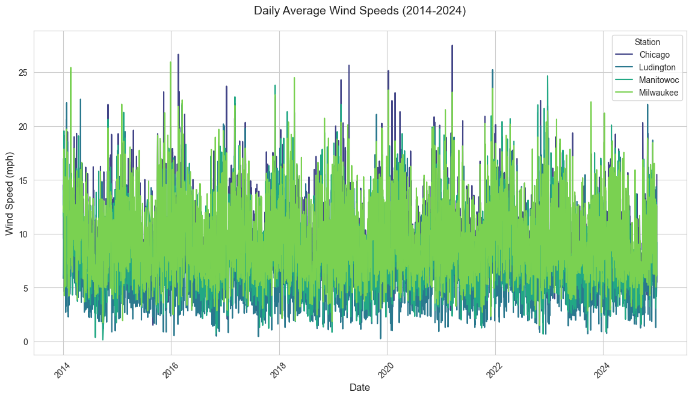
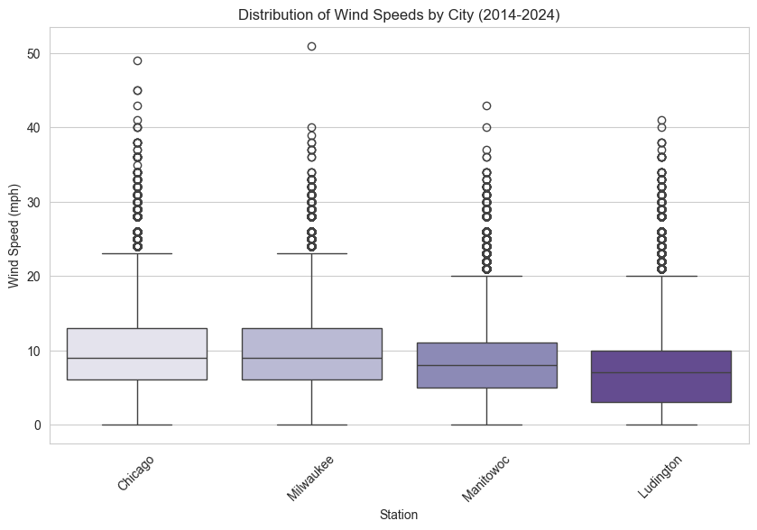
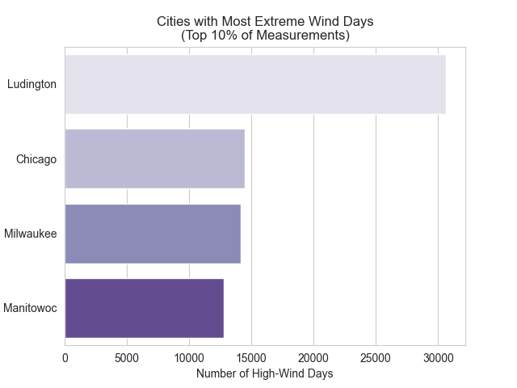
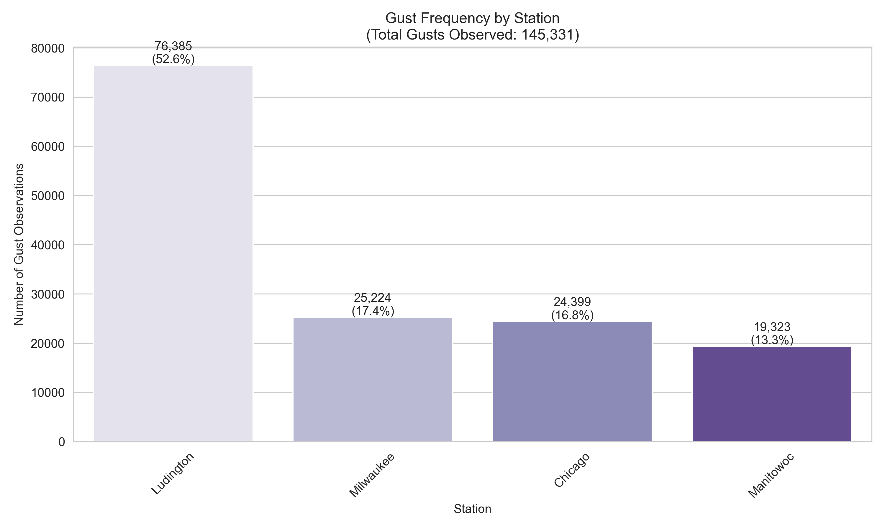
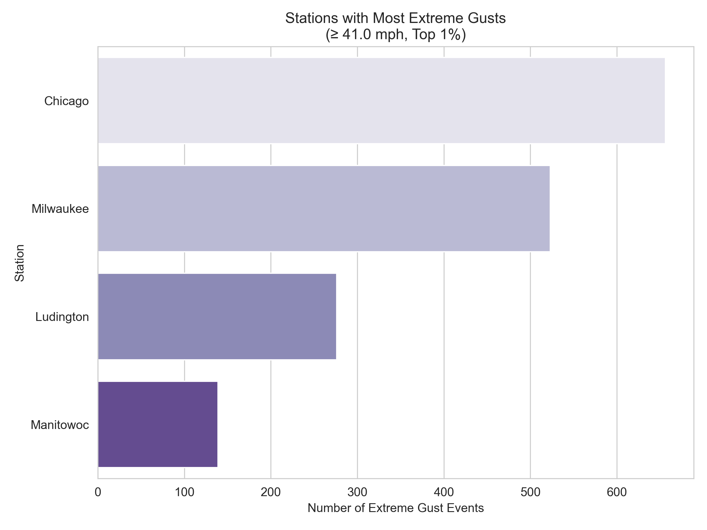

# Chicago Wind Report
#### Presented by Lauren McKay
## Introduction
  Growing up in the area, Chicago was often refered to as "The Windy City". Digging further into the etymology, this nickname stems from several sources, many of which having nothing to do with weather. One explanation for the moniker arrises from the political landscape of the city, as the belief that Chicago politicians were often corrupt, and thus full of "hot air". Furthermore, a convoluted baseball fued between the White Sox and the then Cinncinati Red Sox might also be to blame. However, the brisk wind off the shores of Lake Michigan have also been known to contribute to ths name. While being located in the pit of the lake no dobt affects the wind off the shore, could there possibly be a "Windier City" off the shores of Lake Michigan? 
  
  I aim to explore this question by comparing Chicago with three other cities off the shores of Lake Michigan, ultimately determining if Chicago righfully deserves the title. To reserach this prompt, the cities I have decided to compare are Milwaukee WI, Ludington MI, and Manitowoc WI. The data employed has been generated from the National Center for Enviornmental Information, specifically the U.S Local Climatological Data (LCD). I approach this problem by using data from each station from years 2014-2024, speicifcally looking at columns of the data related to hourly wind speeds and hourly wind gust speeds. 

  ## Daily Averages
 
To put the average wind speeds throughout time into perspective, I decided to create a graph of the four cities throughout the sample period, to see if any initial outliers existed. All of the cities follow a similar pattern as the years progress with a peak in the first few months of the year, and then another as the fall season arrives. 

## Windspeed by City 
 

## Cities with the Windiest Days 
 

## Cities with the Greatest Frequency of Wind Gusts
 

## Cities with the Intense Gusts
 

## Conclusion 
